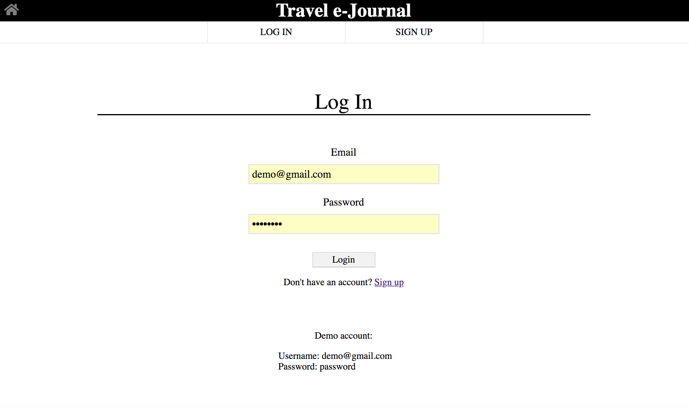
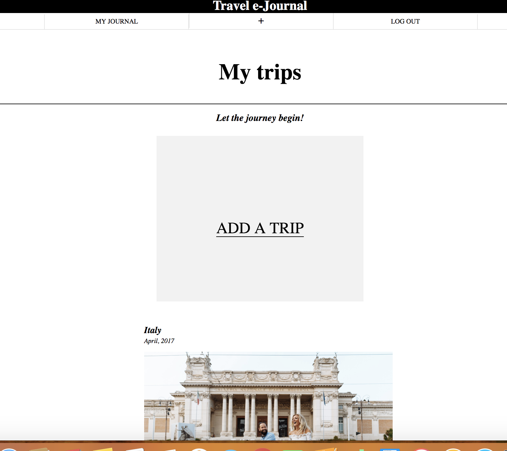
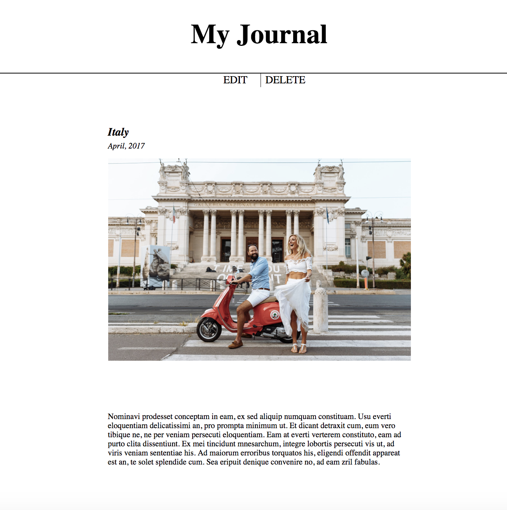

# Travel Journal App

Travel Journal App allows user to create a beautiful online travel journal to 
keep their memories forever. The users are able to add photos and share the best memories from the trip,
add the new foreign words learned or their favorite quotes. Users can view, edit and delete each journal
entry.

## Demo
- [Live Demo](https://travel-journal-app.herokuapp.com/)

## Screenshots

Landing page:

Login Page:

User Dashboard:

Mobile Application/ Fully responsive

# Built With

##Front End
- HTML5
- CSS
- jQuery
- JavaScript

##Back end

- Node.js
- Express.js
- Mocha
- Chai
- Mongo
- Mongoose
- mLab
- bcrypt.js
- Passport
- TravisCI
- Heroku

The app is fully responsive.

